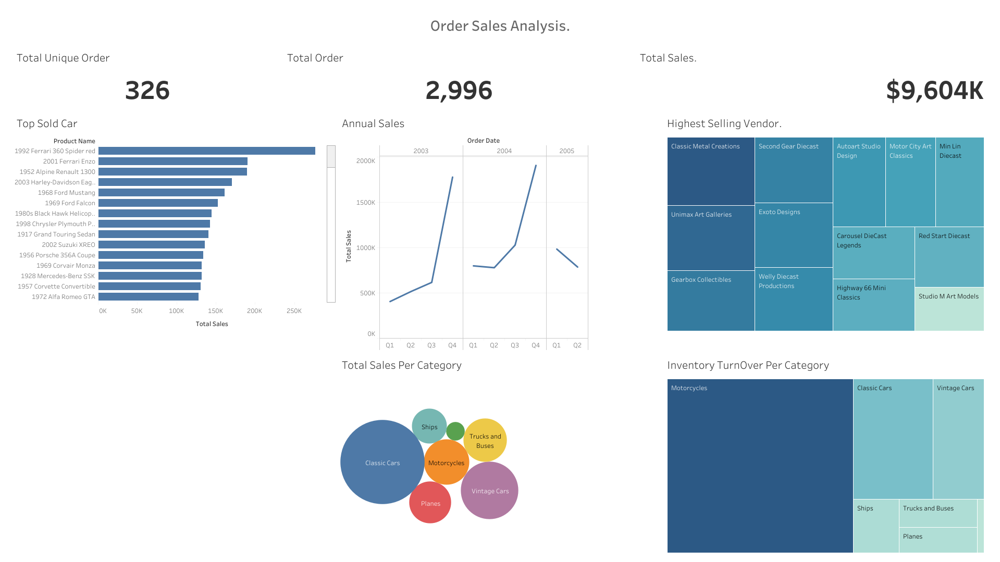

# Customer and Product Analysis using a Scale Model Car Database.

The goal of this project is to analyse data from a sales records database for scale model
cars and extract information for decision-making.

## Table of Content
- [Objective](objective)
- [Data Tools](data-tools)
- [Data Format](data-format)
- [Schema](schema)
- [Database Description](database-description)
- [Problem Solving](problem-solving)
- [Conclusion](conclusion)

    

## Objective
Good analysis starts with questions. Below are the questions we want to answer for this project.
1. Which products should we order more of or less of?
2. How should we tailor marketing and communication strategies to customer behaviours?
3. How much can we spend on acquiring new customers?

## Data Tools
- SQLite Studio
- Tableau

## Data Format: 
SQLite database.
The database was obtained from dataquest and uploaded into sqlite studio. Exploring the
database to unveil patterns, anomalies, and correlations that can be leveraged within the
retail dataset to make data driven decisions.

## Schema
The scale model cars database schema is as follows.
It contains eight tables:
1. Customers: customer data
2. Employees: all employee information
3. Offices: sales office information
4. Orders: customers' sales orders
5. OrderDetails: sales order line for each sales order
6. Payments: customers' payment records
7. Products: a list of scale model cars
8. ProductLines: a list of product line categories

## Database Description
A .sql file was created within the SQLite3 Studio for all queries. A description of the database
was done by understanding the schema of the table.
Here is the displayed table indicating the number of column and number of rows of each
table within the database;
Table Name Number of Attributes Number of Rows
Customers 13 122
Products 9 110
ProductLines 4 7
Orders 7 326
OrderDetails 5 2996
Payments 4 273
Employees 8 23
Offices 9 7

- Customer table Description.
Table Name: Customers
Purpose: This table stores information about customers available in our car model store.
Key Columns:
● customerNumber (Primary Key and foreign key to orders and payment table)
● customerName
● contactLastName
● contactFirstName
● Phone
● addressLine1
● addressLine2
● City
● State
● postalCode
● Country
● saleRepEmployeeNumber (Foreign key to the Employees Table)
● creditLimit
Relationships: The Customer table is linked to the Orders table and Payments table
through the customerNumber column, establishing the orders and payment of each
customer.

- Employees Table Description
Table Name: Employees
Purpose: This table stores information about employees available in our car model store.
Key Columns:
● employeeNumber
● lastName
● firstName
● Extension
● Email
● officeCode (Foreign Key)
● reportsTo
● jobTitle
Relationships: The Office table is linked to the employees table through the officeCode
column, establishing the office and employees of each customer.

- OfficeTable Description
Table Name: Offices
Purpose: This table stores information about offices available in our car model store and
where they have been located.
Key Columns:
● officeCode (Primary Key)
● City
● Phone
● addressLine1
● addressLine2
● State
● Country
● postalCode (Foreign Key)
Relationships: The Office table is linked to the employees table through the officeCode
column, establishing the office and employees of each customer. Also linked to the
customers table through the postalCode.

- OrderDetails Table Description
Table Name: OrderDetails
Purpose: This table stores information about employees available in our car model store.
Key Columns:
● employeeNumber
● lastName
● firstName
● Extension
● Email
● officeCode
● reportsTo
● jobTitle
Relationships: The Office table is linked to the employees table through the officeCode
column, establishing the office and employees of each customer.

- Orders Table Description
Table Name: Orders
Purpose: This table stores information about when orders are made in date in dates.
Key Columns:
● orderNumber(Primary Key)
● orderDate
● requiredDate
● shippedDate
● Status
● comment
● customerNumber
Relationships: The order table is linked to the orderDetails table using the orderNumber as
primary key.

- Payments Table Description
Table Name: Payments
Purpose: This table stores information about payments made by customer along with the
amounts
Key Columns:
● customerNumber
● checkNumber
● paymentDate
● amount
Relationships: The payment table is linked from the customers table through the
customerNumber column as the foreign key in the payment table.

- Product-line Table Description
Table Name: ProductLine
Purpose: This product-line table stores information about the model car categories.
Key Columns:
● productLine
● textDescription
● htmlDescription Null
● Image Null
Relationships: The product-line table is linked from the products table through the
product-line column as the foreign key in the product-line table.

- Products Table Description
Table Name: Products
Purpose: This table stores information about products, vendor, buy-price and the MSRP.
Key Columns:
● productCode
● productName
● productLine
● productScale
● productDescription
● quantityInStock
● buyPrice
● MSRP
Relationships: The product table is linked to the orderDetails table with the productCode
column as the primary key.

## Problem Solving 
- How should we match marketing and communication strategies to customer behaviour.
This involves categorising customers: finding the VIP customers(that bring in the
most profit for the store) and those who are less engaged customers (that bring in
less profit). For example, we could organise some events to drive loyalty for the VIPs
and launch a campaign for the less engaged.

- How much can we spend on acquiring new customers?
Computing the Customer Lifetime Value (LTV), which represents the average
amount of money a customer generates. We can then determine how much we can
spend on marketing.

## Conclusion 
The SQL codeline for finding the VIP customers, the leass engaging and more engaging customers, and the customers Lifetime Value (LTV) can be seen in the .sql file
The visualization presented the Total unique order, the total order, the total sales, top sold cars, Annual sales, highest selling vendors, top sales per category, and the Invetory turnover per category.
